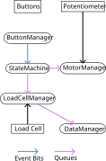
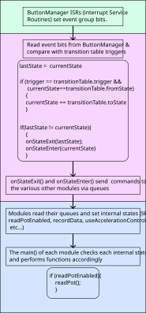

# Architecture

This project is built around the class StateMachine. It keeps tack of what state the tensile tester is in and changes states based on button presses. When it changes state, it sends commands to the other modules via FreeRTOS queues. Each module has its own set of private states which it updates based on the commands from the StateMachine.

The following diagrams give a high level overview of the project as of July 2026

<!-- Fix missing arrow -->

{width=20%}

 
 

<!-- Add StateMachine to "read event bits" in first purple block -->

{width=20%}

